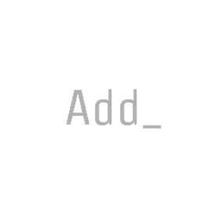
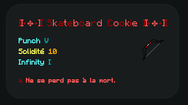
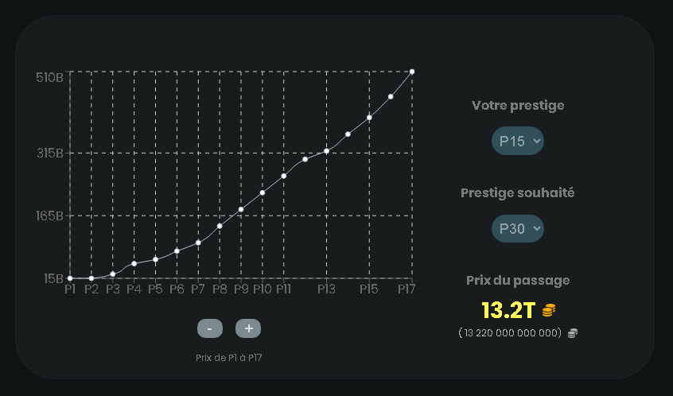
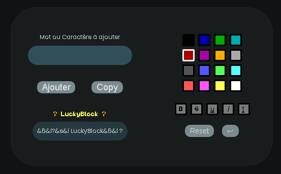

<a name="readme-top"></a>

<div align="center">
  
  <h3 align="center">SkyOfSkill ToolBox</h3>
</div>

<br />

<ol>
  <li>
    <a href="#features">Features</a>
    <ul>
      <li><a href="#minage">Minage</a></li>
      <li><a href="#caisses">Caisses</a></li>
      <li><a href="#prestiges">Prestiges</a></li>
      <li><a href="#colored-text">Colored Text</a></li>
    </ul>
  </li>
  <li>
    <a href="#special-thanks">Special Thanks</a>
  </li>
</ol>

<br />

[![React][React.js]][React-url]

## Features

---

### Minage

_Formule du calcul théorique de combien chaque bloc de votre mine vous donne en fonction de votre pioche ainsi que du boost que vous allez utiliser._

```js
const blocValue = mineValue * (picFortune + 1) * multiplyBoost;
```

Avec ce calcul nous pouvons estimer combien faisons nous toute les 30 secondes et toutes les 15 minutes.

<p align="right">(<a href="#readme-top">début de page</a>)</p>

---

### Caisses

Visualisez TOUT les items du serveur ! Les pioches, les armures, les épées, les arcs et les haches.
Et en couleur !

<div align="center">
  
</div>
<br />
<p align="right">(<a href="#readme-top">début de page</a>)</p>

---

### Prestiges

Permet de calculer le prix du passage de un ou de plusieurs prestiges, ainsi que de visionner l'évolution des prix.
<br />
_PS : Les prix peuvent changer dans le temps._

<div align="center">
  
</div>
<br />
<p align="right">(<a href="#readme-top">début de page</a>)</p>

---

### Colored Text

Formate un texte que tu souhaites avec des couleurs et des modifications infinie !

<div align="center">
  
</div>
<br />
<p align="right">(<a href="#readme-top">début de page</a>)</p>

---

## Special Thanks

- Pour l'aide sur les noms des items de box:
  - HDIFOX302 (17 items)
  - OverRhity (12 items)
- Pour l'aide sur les différents prix des prestiges:
  - Okamino\_
  - HDIFOX302
  - OverRhity

<p align="right">(<a href="#readme-top">début de page</a>)</p>

[React.js]: https://img.shields.io/badge/React-20232A?style=for-the-badge&logo=react&logoColor=61DAFB
[React-url]: https://react.dev/
