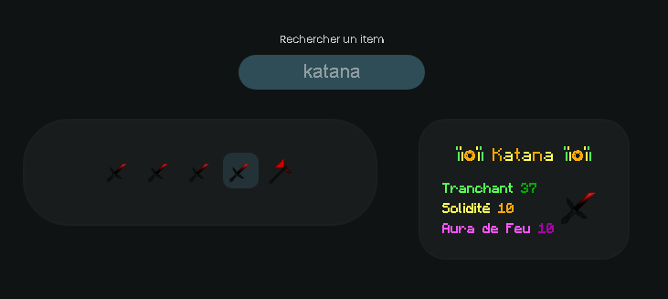

<a name="readme-top"></a>

<div align="center">
  
  
  <a href="https://firedrox.github.io/skyofskill/">
    <h3 align="center">Boîte à Outils SkyOfSkill 🛠️🎮</h3>
  </a>
</div>

<br />

<ol>
  <li>
    <a href="#features">Features</a>
    <ul>
      <li><a href="#minage">Minage</a></li>
      <li><a href="#caisses">Caisses</a></li>
      <li><a href="#prestiges">Prestiges</a></li>
      <!-- <li><a href="#colored-text">Colored Text</a></li> -->
    </ul>
  </li>
  <li>
    <a href="#special-thanks">Special Thanks</a>
  </li>
</ol>

<br />

[![React][React.js]][React-url]
[![contributors][contributors-shield]][contributors-url]
[![stars][stars-icon]][stars-url]
[![Discord][discord-icon]][discord-url]

> [!WARNING]
> Les informations fournies peuvent être obsolètes et sujettes à modification dans le temps !

> Ce projet est personnel et n'est pas affilié au serveur de `TryToKnowMe_` > _(play.skyofskill.fr)_

## Features

---

### Minage

Pour estimer le rendement potentiel de chaque bloc extrait de votre mine, vous pouvez utiliser la formule suivante, qui prend en compte la valeur de la mine, la qualité de votre pioche (exprimée par un coefficient de fortune), ainsi que l'effet multiplicateur d'un éventuel boost :

```js
const blocValue = mineValue * (picFortune + 1) * multiplyBoost;
```

En utilisant cette formule, vous pouvez estimer la production toutes les 30 secondes ainsi que toutes les 15 minutes.

<p align="right">(<a href="#readme-top">Retour en haut de la page</a>)</p>

---

### Caisses

Affichez tous les éléments du serveur en un coup d'œil ! Des pioches aux armures, en passant par les épées, les arcs et les haches. Et avec une touche de couleur !

<div align="center">
  
</div>
<br />

> [!NOTE]
> Recherchez `type:` suivi d'un type d'objet ou de `all`, pour afficher tous les items du même type en une seule fois

<p align="right">(<a href="#readme-top">Retour en haut de la page</a>)</p>

---

### Prestiges

Facilitez le calcul du coût pour passer un ou plusieurs niveaux de prestige, et visualisez l'évolution des prix avec cette fonctionnalité.
<br />

<div align="center">
  
</div>
<br />

<p align="right">(<a href="#readme-top">Retour en haut de la page</a>)</p>

---

<!-- ### Colored Text

Personnalisez votre texte avec des couleurs et des modifications infinies selon vos préférences !

<div align="center">
  
</div>
<br />

<p align="right">(<a href="#readme-top">Retour en haut de la page</a>)</p>

--- -->

## Special Thanks

- Pour l'aide concernant les noms des objets des caisses :

  - FireDroX (194 objets)
  - OverRhity (18 objets)
  - HDIFOX302 (17 objets)
  - yoann71C (17 objets)
  - Diictateur_DowN (2 objets)

- Pour l'aide sur les prix des différents niveaux de prestige :

  - Okamino\_
  - HDIFOX302
  - OverRhity

<p align="right">(<a href="#readme-top">Retour en haut de la page</a>)</p>

---

<div align="center">
  <br/>
  
  <br/>
</div>

> Icon by [@Sawaratsuki](https://x.com/sawaratsuki1004) ;
> Github [ServiceLogos](https://github.com/SAWARATSUKI/ServiceLogos)

[React.js]: https://img.shields.io/badge/React-20232A?style=for-the-badge&logo=react&logoColor=61DAFB&colorB=555
[React-url]: https://react.dev/
[contributors-shield]: https://img.shields.io/github/contributors/firedrox/skyofskill.svg?style=for-the-badge
[contributors-url]: https://github.com/FireDroX/skyofskill/graphs/contributors
[stars-icon]: https://img.shields.io/github/stars/firedrox/skyofskill.svg?style=for-the-badge
[stars-url]: https://github.com/FireDroX/skyofskill/stargazers
[discord-icon]: https://img.shields.io/badge/Discord-5865F2?style=for-the-badge&logo=discord&colorB=555
[discord-url]: https://discord.gg/qJsZxEaZVM
